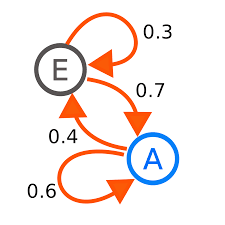

# sentence-generator

## What This Does
In this project I created a webapp using flask that you can go to at [project](https://github.com/GaelGil/markov-app).
In this website you can input some text into a form that will then generate a sentence from that text. It does this by creating a markov chain with the text. If you don't know what a markov chain is you can go to my [website](https://gaelgil.github.io/my_markov_chain/) where introduce markov chains. But in its simplest form it creates a dictionary with probabilities. These probabilities can be used to predict what words come after each other. With this we can create a sentence. Down below will be a visual to even further understand.

The image above is a simple markov chain. As you can see Point E is more likely to go to Point A, but Point A is just slightly more likely to go back to itself. A real life example of this is the weather. Using a markov chain you can predict what the weather will be given the weather before. If we create a visual representation for the weather a simple visual would look like this. In pi

## Try it out
To install the requirements we can do `pip install -r requirements.txt`. Because Im using flask for this project to start the project we will need to run `export FLASK_APP=app.py` and lastly `flask run`

## Things to note
This app is currently deployed on heroku [here](https://github.com/GaelGil/markov-app). In a production environment, the application’s front end will live on a different server from the markov model. However, this model is lightweight so to keep things simpler I left it on the same server. Ideally the model would be on a seperate gcp for aws server and my heroku server that hosts the frontend would just call my model server and return some output. I was previously able to do this by using google cloud platform for my model server and heroku for frontend. I needed the free gcp credits for a larger project so for now the model doesn't have a seperate server. Therefore `api.py` is not being used.
